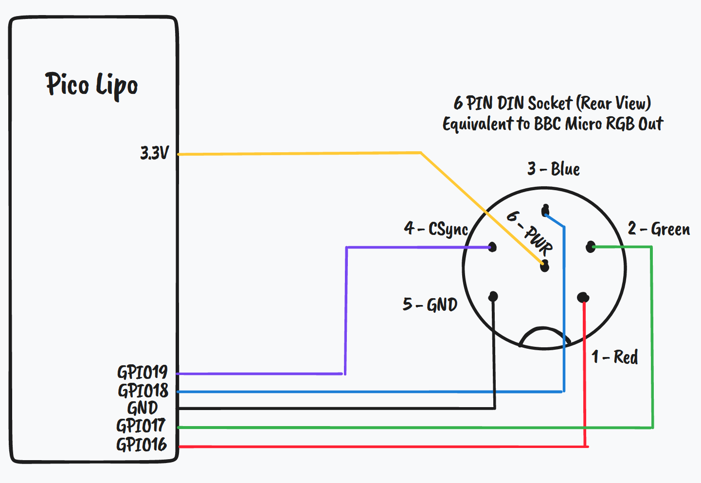

# pico-pattern

Pico-pattern is a video pattern generator based on the Raspberry Pi Pico for testing 8-bit era CRT monitors such as the Microvitec Cub. Pico-pattern uses the video generator from [pico-mposite](https://github.com/breakintoprogram/pico-mposite).

The main target of pico-pattern is to generate video with TTL-compatible R,G,B and Composite Sync at 50Hz as used by the BBC Micro.

** Currently this version is experimental and untested on a real Cub Monitor! **

Pico-pattern offers a range of typical video test patterns including:

- Colour Bars
- Pure White
- Line Grid
- Dot Grid
- Centre Cross Hairs

## Software Build and Deployment

If you want to use the pre-built output then you can just download the file `build/pico-pattern.uf2` and skip to the last paragraph of this section. 

It is recommended to build on a Linux environment. I used Ubuntu under WSL2.

To build yourself follow these instructions:

Install the [Pi Pico C SDK](https://github.com/raspberrypi/pico-sdk) and all the necessary build tools.

Clone this repository to a sibling folder of the SDK. From a commend line cd into the pico-pattern directory and use the following commands (with appropriate change for your system):

```
cd build
cmake -DPICO_SDK_PATH=/path/to/pico-sdk ..
make
```

This should generate a file `build/pico-pattern.uf2`. 


Connect a Pi Pico to the computer while holding down the BOOTSEL button. Copy the `build/pico-pattern.uf2` file to the Pi Pico virtual drive.

## Hardware for Pimoroni Pico Lipo

My version is constructed using a Pimoroni Pico Lipo which creates a battery powered version with a minimum of external components. The schematic is below. In the Pico Lipo the "boot" button doubles as a user button to select the pattern to display.



## Hardware for Normal Pi Pico

Connect the DIN socket as shown for the Pico Lipo. If you have a 5V system bus then connect the centre pin to 5V rather than 3.3V for a closer match to a real BBC Micro.

For a normal Pi you will need to change the software to enable a pull up for the user button in the file `main.h`.

You will need to choose a suitable power option. The easiest is just to power from the USB port via an external supply or a USB boost battery. The pattern generator draws about 20mA at 5V or 60mA at 3V so powering from 2 or 3 AA batteries would also be an option. See the Pi Pico Datasheet for information on how to attach an external power supply.


## Use 

Program the Pi Pico as described above. Construct the hardware and connect to a suitable monitor. Power On!

The external button will advance through the different patterns. The LED on the Pi Pico will flash the number of the current pattern.

- 1 = Colour Bars
- 2 = White Screen
- 3 = Grid
- 4 = Dots
- 5 = Centre Cross Hairs
- 6 = Border and circle


## Notes

Dean is very disparaging about Pico-mposite, but I think it works really well and demonstrates very nicely the power of the DMA and PIO state machines on the RP2040. Great work Dean! 

The Pi Pico is a 3.3V part, but this should be ample headroom over the 5V TTL threshold for a "high" signal. Therefore I have not included level shifters in this design.

Professional video pattern generators often include the pattern over the full area of the scan (including areas that are normally off-screen). For most patterns this version only includes the pattern within the border of the normal picture. For my specific application this is preferable, but it wouldn't be a big job to modify the behaviour.

The video output from this device is not interlaced.
